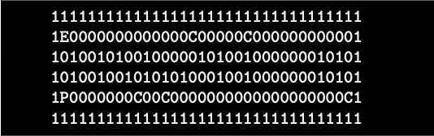

# so_long

[](https://github.com/JaeSeoKim/badge42)

This project is a very small 2D game.
Its purpose is to make you work with textures, sprites,
and some other very basic gameplay elements.

defaulf branch - bonus.

Этот проект представляет собой очень маленькую 2D-игру.
Его цель - заставить вас работать с текстурами, спрайтами,
и некоторыми другими базовыми элементами геймплея.

Цель игрока - собрать все предметы, имеющиеся на карте, а затем сбежать,
выбирая кратчайший возможный путь.

- Для перемещения главного героя необходимо использовать клавиши W, A, S и D.
- Игрок должен иметь возможность двигаться в этих 4 направлениях: вверх, вниз, влево, вправо.
- Игрок не должен натыкаться на стены.
- При каждом перемещении в окне должно отображаться текущее количество движений.
- Вы должны использовать 2D вид (сверху вниз или в профиль).
- Игра не обязательно должна быть в реальном времени.


- Ваша программа должна отображать изображение в окне.
- Управление окном должно быть плавным (переход в другое окно, сворачивание и т.д.).
- Нажатие клавиши ESC должно закрывать окно и выводить программу в чистом виде.
- Нажатие на крестик на рамке окна должно закрыть окно и выйти из программы чистым способом.
- Использование библиотеки MiniLibX является обязательным.

Карта должна быть построена из 3 компонентов: стен, предметов коллекционирования и свободного
пространствa.

Карта может состоять только из этих 5 символов:
* 0 - пустое пространство,
* 1 - стена,
* C - предмет коллекционирования,
* E - выход с карты,
* P - начальная позиция игрока.


- Карта должна содержать как минимум 1 выход, 1 предмет коллекционирования и 1 стартовую позицию.
- Карта должна быть прямоугольной.
- Карта должна быть замкнутой/окруженной стенами. Если это не так, программа должна вернуть
ошибку.
- Вы не должны проверять, есть ли в карте правильный путь.
- Вы должны уметь разбирать любой вид карты, если в ней соблюдаются вышеуказанные правила.
- Еще один пример минимальной карты .ber:


- Если в файле встречается какая-либо неправильная конфигурация, программа должна
завершить работу чистым способом и вернуть "Error\n" с явным сообщением об ошибке по вашему выбору.

## Usage

```
make && make bonus && ./so_long test_bon.ber
```

Полный subject можно посмотреть <a href="./en.subject.pdf">тут</a>.
